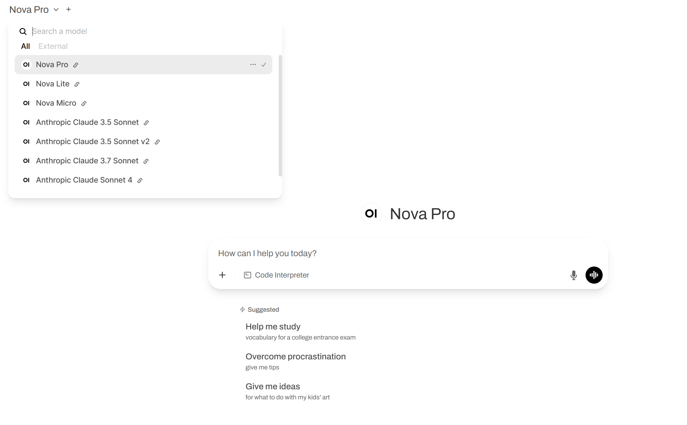
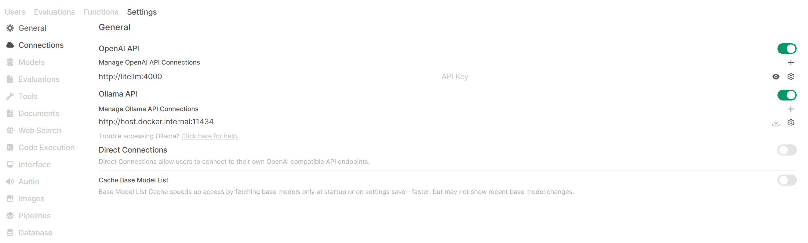
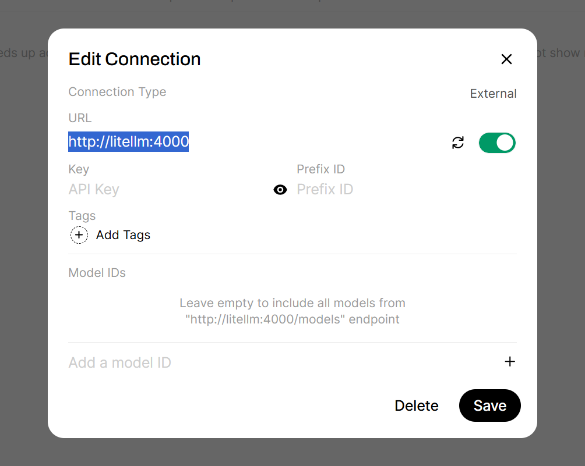

# Open WebUI with Amazon Bedrock

This is an example of running Open WebUI in a local environment.

- Use LiteLLM to convert Amazon Bedrock into an API compatible with OpenAI's OpenAPI.
- Use Amazon Bedrock models with Open WebUI.



## How to Start

Create a `.env` file and set the `AWS_PROFILE`:

```
AWS_PROFILE="examples"
AWS_REGION="ap-northeast-1"
```

Start with the following command:

```bash
docker-compose up
```

Each service will be available at the following ports:

- [Open WebUI](http://localhost:3000)
- [LiteLLM](http://localhost:4000)

### LLM Settings

Go to "Top right icon" -> "Admin Panel" -> "Settings" -> "Connections" and configure the "OpenAI API" section.

You can access Connections directly from [this link](http://localhost:3000/admin/settings/connections).



Enter `http://litellm:4000` in the URL field:


